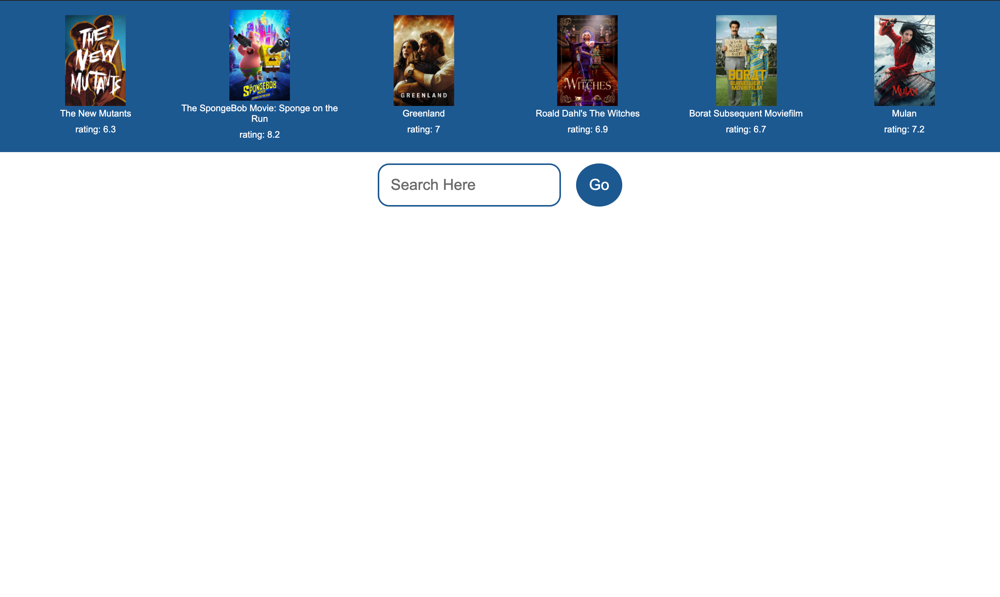
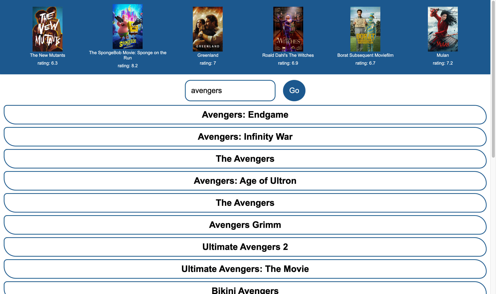
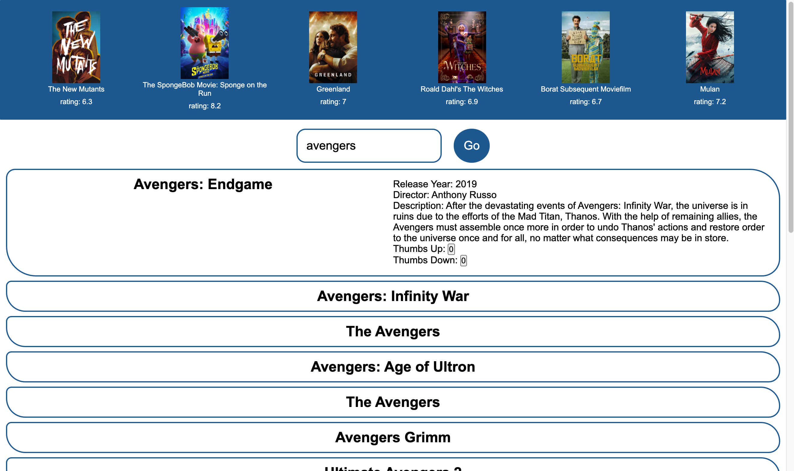

# Movie List

A web application which allows you to search and upvote/downvote movies

# Installation
Create an account from the movie db
https://www.themoviedb.org/

Add API key in the server/config folder

if you only want to interact with the web application
  - npm run server

if you want to make some changes
  - npm install
  - npm run build (seperate terminal)
  - npm run server

# Images
## Main Page

## Search Functionality

## Movie Info
